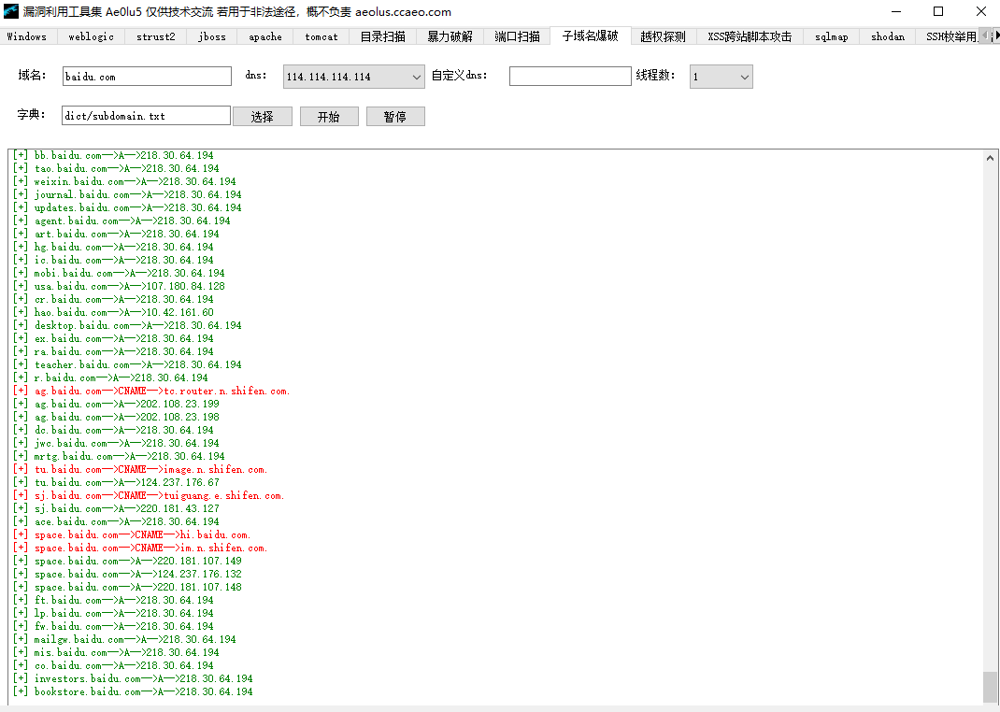

# Ae0lu5 漏洞利用工具集
一个图形化的漏洞利用集成工具，它用python3编写，参考了大量安全工具的实现原理与思想，在工作之余开发，方便自己的渗透测试工作，我的目的是打造一个红队武器化工具，路还很长，慢慢更新！

## 提示
本工具提供了大量含有攻击payload的代码，希望大家正确使用该工具，切勿用于非法用途！本人概不负责！
由于时间原因，本工具没有进行全方位的测试。


## 框架介绍
### 安装
```sh
git clone https://github.com/AeolusTF/Ae0lu5.git
cd Ae0lu5
pip3 install -r requirements.txt -i https://mirrors.aliyun.com/pypi/simple/
```
如果接下来运行失败，若您是linux操作系统，请手动安装pyqt5以kali为例：  
```
sudo apt-get install python3-pyqt5
```  
若您要使用与ysoserial相关的利用程序,请您手动下载,因为默认该文件夹是空的  
上述安装您将直接获得本工具的源代码，推荐这种安装方式，但因本工具为图形化工具考虑到实用性以及简单性，大家可以自行构建自己的可执行程序，推荐使用Pyinstaller。  

### 目录结构
- Ae0lu5.py 是本工具的入口文件。
- dict 该目录存放了本工具自带的一些字典
- tool 该目录存放了常用的渗透测试工具，方便被调用
- plugins 该目录存放了本工具所有的攻击代码库
- weblogic_gui.ui 为PyQt的ui文件

## 使用方法
```sh
python3 Ae0lu5.py
```

#### 攻击截图如下



